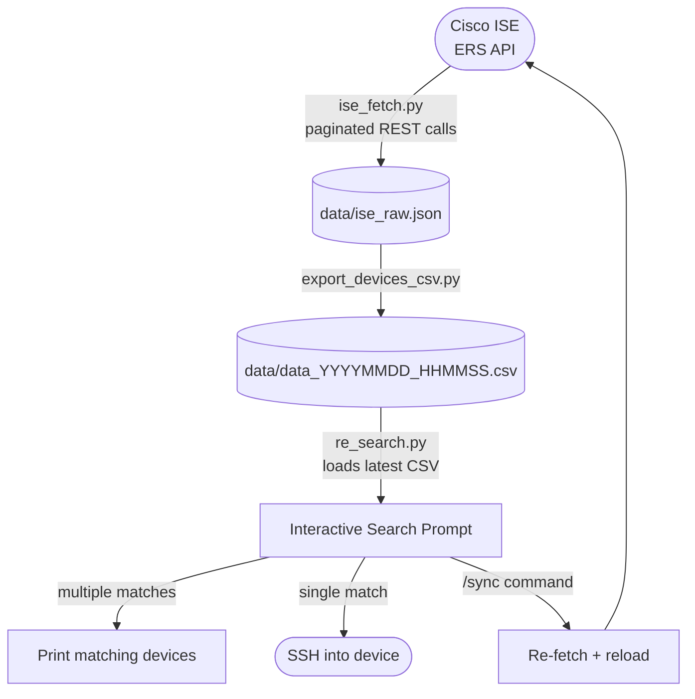

# Gatekeeper

A lightweight toolkit for querying Cisco ISE network devices and SSHing into them directly from the terminal. Search by name, location, type, or any combination — if there's exactly one match, you're connected automatically.

---

## Related Projects

| Project | Description |
|---|---|
| [gatekeeper_user]([http://test.com](https://github.com/EspressoByte/gatekeeper_user)) | C wrapper that captures the current username and passes it to Gatekeeper — enables dynamic username injection without manual `/user` setup |

---

## Features

- Fetches all network devices from Cisco ISE via the ERS API (paginated, retry with exponential backoff, progress bar)
- Exports device data to a timestamped CSV (name, IP, location, device type)
- Auto-purges CSV files older than 30 days
- Interactive regex search across the device inventory (comma-separated terms use AND logic)
- Tab completion for device names, locations, and types at the search prompt
- Auto-connects via SSH when a search returns a single result
- **Ping mode** — toggle with `/ping`; prompt changes to `[Ping]:` and single matches are pinged instead of SSH'd
- Optional SSH session logging via `script`
- `/sync` refreshes data without leaving the search prompt

---

## Flow



---

## Requirements

- Python 3.7+
- [requests](https://pypi.org/project/requests/)
- Cisco ISE with ERS API enabled (Admin › System › Settings › ERS Settings)

```bash
pip install requests
```

---

## Configuration

Create a `config.env` file in the project root with the following keys:

```
ISE_HOST=172.16.0.150
ISE_PORT=9060
ISE_USERNAME=your_username
ISE_PASSWORD=your_password
VERIFY_SSL=false
```

`config.env` is gitignored and never committed. Credentials are loaded at runtime via `os.environ`.

> Set `VERIFY_SSL=true` whenever possible. Leaving it `false` exposes credentials to interception on the network segment.

---

## Usage

### 1. Fetch device data from ISE

```bash
python3 ise_fetch.py
```

Pages through the ISE ERS API and writes all device records to `data/ise_raw.json`.

### 2. Export to CSV

```bash
python3 export_devices_csv.py
```

Produces a timestamped CSV at `data/data_YYYYMMDD_HHMMSS.csv` and deletes `ise_raw.json`. CSV files older than 30 days are automatically purged.

### 3. Search and connect

```bash
python3 re_search.py
```

At the prompt, type any search term. Separate multiple terms with commas — all must match (AND logic). Regex is supported.

```
Enter search: atlanta, router
```

Press **Tab** to complete partial terms from the loaded device vocabulary (names, locations, types). Double-Tab shows all options when there are multiple matches.

- **Multiple matches** → list of device names and IPs is printed
- **Single match** → SSH session opens automatically (or ping if ping mode is active)

When ping mode is active, the prompt changes from `Enter search:` to `[Ping]:` as a visual indicator that single matches will be pinged rather than SSH'd.

#### Prompt commands

| Command | Description |
|---|---|
| `/sync` | Re-fetch from ISE and reload the device list |
| `/user <name>` | Set the SSH username (defaults to current OS user) |
| `/log` | Toggle SSH session logging to `~/session_logs/` |
| `/ping` | Toggle ping mode (prompt changes to `[Ping]:`) |
| `/help` | Show current config and available commands |
| `exit` / `quit` | Exit the tool |

---

## IP address handling

ISE allows multiple IP addresses to be registered per network device. When exporting to CSV, **the first IP in ISE's `NetworkDeviceIPList` is used**. This matches the primary management address as ordered in ISE.

All IPs are expected to be **/32 host entries** — ISE registers individual device management addresses, not subnets. The SSH connection is made directly to this address.

---

## Project Structure

```
.
├── ise_fetch.py            # Fetches all devices from ISE ERS API → ise_raw.json
├── export_devices_csv.py   # Converts ise_raw.json → timestamped CSV
├── re_search.py            # Interactive search prompt + SSH/ping launcher
├── config.env              # Credentials and settings (gitignored)
└── data/
    └── data_*.csv          # Exported device CSVs (generated, gitignored)
```
